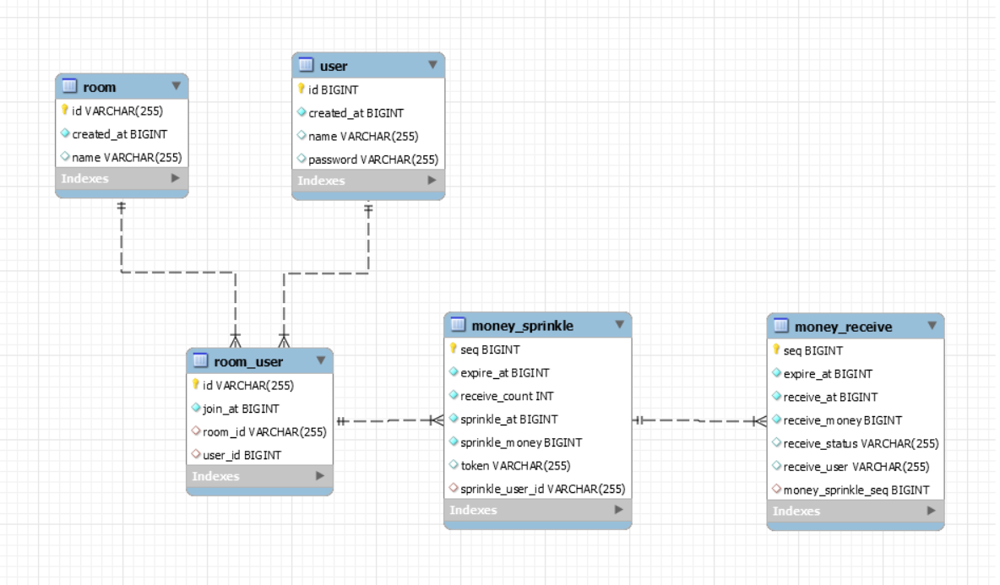

## 카카오페이 서버개발 사전과제

> 카카오페이 뿌리기 기능 구현하기

## 개발 프레임워크
 - JAVA 11
 - Springboot-2.4.2.RELEASE
 - Gradle
 - JPA
 - Lombok
 - MySql 8.0.20
 
## DB 구성
현재 jdbc 경로가 AWS 기반에 설치된 MySql DB로 설정한 상태입니다. \
JPA 초기화 전략이 ddl-auto: create으로 데이터베이스 drop을 실행하고 생성된 DDL을 실행합니다. \
테이블이 생성되면 /resources 하위에 data.sql의 초기 데이터가 insert 됩니다. \
재기동을 하면 기존에 저장된 정보는 모두 사라지는 점 유의하시기 바랍니다.

## 테이블 구성



### API 명세
	
POST /money/sprinkle
	- 기능 : 머니 뿌리기 

PUT /money/receive/{token}
	- 기능 : 머니 받기
	
GET /money/sprinkle/{token}
	- 기능 : 뿌리기 조회
	
### 0. 공통
* HTTP Header \
요청 HTTP Header에 대화방 ID와 사용자 ID를 전달합니다. \
-대화방 ID : X-ROOM-ID \
-사용자 ID : X-USER-ID 

* Error

| 에러 코드       | 설명                                                         |
| :-----  | ------------------------------------------------------------ |
| 400  | Request 필드 부족 or 형식 불일치  |
| 405  | Rest Method 불일치      |

	
### 1. 머니 뿌리기
뿌릴 금액, 뿌릴 인원을 요청값으로 받아 정보를 db에 저장합니다. -> money_sprinkle \
뿌릴 금액을 인원수에 맞게 분배되는 정보를 db에 저장합니다. -> money_receive \
고유 token을 발급하고 응답값으로 내려줍니다. 

POST /money/sprinkle

* Request
```
curl -X POST http://localhost:8080/money/sprinkle 
  -H 'Content-Type: application/json' 
  -H 'X-ROOM-ID: AAA' 
  -H 'X-USER-ID: 3' 
  -d '{
       "data":{
       "sprinkle_money":"20000",
       "receive_count":"2"
       }
   }'
```
* Response
```
200 OK
{
    "transaction_time": "2021-01-19T07:31:09.1891596",
    "result_code": "OK",
    "description": "OK",
    "data":{
        "sprinkle_money": 20000,
        "sprinkle_at": 20210119073108,
        "token": "HIT",
        "receive_list": null,
        "receive_money": 0
    }
}
```

* Error

| result_code       | 현상                                                         |
| :-----  | ------------------------------------------------------------ |
| FAIL  | 대화방에 사용자가 존재하지 않을때 |


#### 2. 머니 받기

PUT /money/receive/{token}

* Request
```
curl -X PUT http://localhost:8080/money/receive/{token} 
  -H 'Content-Type: application/json' 
  -H 'X-ROOM-ID: AAA' 
  -H 'X-USER-ID: 4' 
```

* Response

```
200 OK
{
    "transaction_time": "2021-01-19T07:33:23.6286887",
    "result_code": "OK",
    "description": "OK",
    "data": {
        "receive_money": 10000,
        "receivee_at": 20210119073323
    }
}
```

* Error

| result_code       | 현상                                                         |
| :-----  | ------------------------------------------------------------ |
| FAIL  | 대화방에 사용자가 존재하지 않을때 |
| FAIL | token값에 해당하는 데이터가 없을때 |
| FAIL | 자신이 뿌리기한 건을 자신이 받을때 |
| FAIL | 뿌린이와 동일한 대화방에 속한 사용자가 아닐때 |
| FAIL | 뿌린지 10분이 지난 요청일때 - 받기 만료시각 지남|


#### 3. 뿌리기 조회

GET /money/sprinkle/{token}

* Request
```
curl -X GET http://localhost:8080/money/sprinkle/{token} 
  -H 'Content-Type: application/json' 
  -H 'X-ROOM-ID: AAA' 
  -H 'X-USER-ID: 3' 
```

* Response

```
200 OK
{
    "transaction_time": "2021-01-19T07:36:14.1450291",
    "result_code": "OK",
    "description": "OK",
    "data": {
        "sprinkle_money": 20000,
        "sprinkle_at": 20210119073108,
        "token": null,
        "receive_list": [
            "AAA4",
            "AAA20"
        ],
        "receive_money": 20000
    }
}
```

* Error

| result_code       | 현상                                                         |
| :-----  | ------------------------------------------------------------ |
| FAIL | 뿌린 사용자가 존재하지 않을때|
| FAIL | 뿌린지 7일이 지난 요청일때 - 조회 만료시각 지남|

## Entity 
* room \
대화방 정보 데이터 \
논리적으로 room_user 테이블과 1:n 관계
```
id : room 식별자 (PK / GeneratedValue)
created_at : 생성 시각 
user_name : 대화방 이름
```

* user \
사용자 정보 데이터 \
논리적으로 room_user 테이블과 1:n 관계
```
id : user 식별자 (PK / GeneratedValue)
created_at : 생성 시각 
user_name : 사용자 이름
user_password : 사용자 비밀번호
```

* room_user \
대화방 사용자 정보 데이터 \
논리적으로 room 테이블과 n:1 관계 \
논리적으로 user 테이블과 n:1 관계 

```
id : room_user 식별자 (PK)
room_id : room 식별자 (FK)
user_id : user 식별자 (FK)
join : 입장 시각 
```

* money_sprinkle \
머니 뿌리기 정보 데이터 \
논리적으로 room_user 테이블과 n:1 관계 \
논리적으로 money_receive 테이블과 1:n 관계 
```
seq : money_sprinkle 식별자 (PK / GeneratedValue)
sprinkle_user_id : room_user 식별자 (FK)
sprinkle_money : 뿌린 금액
sprinkle_at : 뿌린 시각
receive_count : 뿌린 인원
expire_at : 뿌리기 조회 만료 시각
token : 뿌리기 요청건에 대한 고유 token값
```

* money_receive \
뿌린금액에 대한 분배 정보 데이터 \
논리적으로 money_sprinkle 테이블과 n:1 관계
```
seq : money_receive 식별자 (PK / GeneratedValue)
money_sprinkle_seq : money_sprinkle 식별자 (FK)
receive_money : 분배 금액 or 받을 금액
expire_at : 토큰 만료 시각
receive_status : 받기 상태 Y/N
receive_user : 받은 사용자
receive_at : 받은 시각 
```

  
 


  

  
